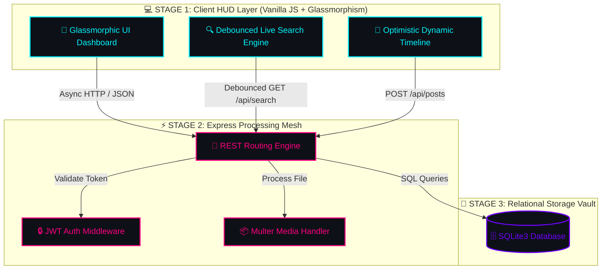

<div align="center">

  <!-- HERO ANIMATED TYPING HEADER -->
  <a href="https://git.io/typing-svg">
    
  </a>

  <p align="center">
    <b>A Next-Gen, Micro-Animated Full-Stack Social Experience</b>
  </p>

  <!-- ANIMATED BADGES STAGE -->
  <p align="center">
    <a href="#-system-architecture-stage">
      
    </a>
    <a href="#-system-architecture-stage">
      
    </a>
    <a href="#-system-architecture-stage">
      
    </a>
    <a href="#-system-architecture-stage">
      
    </a>
    <a href="LICENSE">
      
    </a>
  </p>

  <!-- ANIMATED GLOWING WAVE DIVIDER -->
  

</div>

<br>

---

## ⚡ STAGE 1: REAL-TIME HUD SYSTEM METRICS

<div align="center">
  <a href="https://git.io/typing-svg">
    
  </a>
</div>

<br>

---

## 🔮 STAGE 2: ANIMATED FEATURE CARDS MATRIX

<table width="100%">
  <tr>
    <td width="50%" align="center">
      <br>
      <br>
      <a href="https://git.io/typing-svg">
        
      </a>
      <p>Full signup, login, session retention, password hashing via <code>bcryptjs</code> & stateless <code>JWT</code> security grid.</p>
      
      <br><br>
    </td>
    <td width="50%" align="center">
      <br>
      <br>
      <a href="https://git.io/typing-svg">
        
      </a>
      <p>Optimistic UI updates, multi-line post creation, interactive media gallery, and live dynamic post feeds.</p>
      
      <br><br>
    </td>
  </tr>
  <tr>
    <td width="50%" align="center">
      <br>
      <br>
      <a href="https://git.io/typing-svg">
        
      </a>
      <p>Micro-animated heart pops, instant like/unlike toggles, nested comments section, and saved bookmarks tray.</p>
      
      <br><br>
    </td>
    <td width="50%" align="center">
      <br>
      <br>
      <a href="https://git.io/typing-svg">
        
      </a>
      <p>Real-time debounced search bar matching usernames, bios, and full names with custom dropdown navigation.</p>
      
      <br><br>
    </td>
  </tr>
  <tr>
    <td width="50%" align="center">
      <br>
      <br>
      <a href="https://git.io/typing-svg">
        
      </a>
      <p>Direct upload stream powered by <code>Multer</code> with automatic validation for image & video attachments.</p>
      
      <br><br>
    </td>
    <td width="50%" align="center">
      <br>
      <br>
      <a href="https://git.io/typing-svg">
        
      </a>
      <p>Relational follow/unfollow engine, dynamic user profile analytics, follower counts, and activity notification center.</p>
      
      <br><br>
    </td>
  </tr>
</table>

<br>

---

## 🌌 STAGE 3: SYSTEM ARCHITECTURE FLOW

<div align="center">

  <a href="https://git.io/typing-svg">
    
  </a>

</div>



<br>

---

## ⚡ STAGE 4: QUICK START TERMINAL LAUNCH

<div align="center">

  <a href="https://git.io/typing-svg">
    
  </a>

</div>

```bash
# 1. Clone the Cybernet Repository
$ git clone https://github.com/YOUR_USERNAME/nexora-social-platform.git

# 2. Navigate into the Project Core
$ cd nexora-social-platform

# 3. Inject Module Dependencies
$ npm install

# 4. Synthesize Sample Database Seeds
$ npm run seed

# 5. Ignite the Server Matrix
$ npm run dev
```

---

## 📂 STAGE 5: SYSTEM DIRECTORY TOPOLOGY

```gcode
⚡ NEXORA_CORE_ROOT
 ├── 📁 data/                  ► [STAGE 1] SQLite Database Vault (nexora_social.db)
 ├── 📁 public/                ► [STAGE 2] Client Front-End Engine
 │    ├── 📁 css/              ► Glassmorphic Design System & Micro-Animations
 │    ├── 📁 js/               ► Single-Page Dynamic App Controller
 │    ├── 📁 uploads/          ► Media Storage Stream Buffer
 │    └── 📄 index.html        ► Futuristic HUD Layout Entrypoint
 ├── 📁 src/                   ► [STAGE 3] Server Logic Mesh
 │    ├── 📁 db/               ► Database Schemas & Seeder Logic
 │    ├── 📁 middleware/       ► JWT Security & Authorization Barrier
 │    └── 📁 routes/           ► REST Endpoints (Auth, Posts, Users, Uploads)
 ├── 📄 server.js              ► Master Node Server
 ├── 📄 .gitignore             ► Exclusion Filter
 ├── 📄 LICENSE                ► MIT License Document
 └── 📄 README.md              ► Cyberpunk Systems Manual
```

---

## 🌐 STAGE 6: REST API PROTOCOL MATRIX

| HTTP Method | API Endpoint | Operational Target | Security Barrier | Status Indicator |
| :--- | :--- | :--- | :---: | :---: |
| `POST` | `/api/auth/register` | User Account Provisioning | 🔓 PUBLIC | `<span style="color:#00FF66">● ACTIVE</span>` |
| `POST` | `/api/auth/login` | Issue JWT Token & Auth | 🔓 PUBLIC | `<span style="color:#00FF66">● ACTIVE</span>` |
| `GET` | `/api/auth/me` | Resolve Authenticated Profile | 🔒 JWT | `<span style="color:#00F3FF">⚡ PROTECTED</span>` |
| `GET` | `/api/posts` | Timeline Stream Pipeline | 🔒 JWT | `<span style="color:#00F3FF">⚡ PROTECTED</span>` |
| `POST` | `/api/posts` | Dispatch New Post | 🔒 JWT | `<span style="color:#00F3FF">⚡ PROTECTED</span>` |
| `POST` | `/api/posts/:id/like` | Reaction Matrix Toggle | 🔒 JWT | `<span style="color:#FF007F">💖 ANIMATED</span>` |
| `POST` | `/api/posts/:id/comments` | Post Comment Thread | 🔒 JWT | `<span style="color:#00F3FF">⚡ PROTECTED</span>` |
| `GET` | `/api/users/:username` | User Profile & Posts Graph | 🔒 JWT | `<span style="color:#00F3FF">⚡ PROTECTED</span>` |
| `POST` | `/api/users/:id/follow` | Cyber Graph Connection Toggle | 🔒 JWT | `<span style="color:#7000FF">🔗 LIVE GRAPH</span>` |
| `GET` | `/api/search` | Live Debounced User Query | 🔒 JWT | `<span style="color:#00FF66">🎯 LIVE MATCH</span>` |
| `POST` | `/api/upload` | Media Attachment Buffer Stream | 🔒 JWT | `<span style="color:#FFB700">🖼️ STREAMING</span>` |

---

<br>

<div align="center">

  <!-- ANIMATED GLOWING WAVE DIVIDER -->
  

  <!-- ANIMATED TYPING FOOTER -->
  <a href="https://git.io/typing-svg">
    
  </a>

  <br><br>

  <p><b>Crafted with ⚡ for CodeAlpha Task 2 — Nexora Social Platform</b></p>
  
  <a href="https://github.com/">
    
  </a>

</div>
