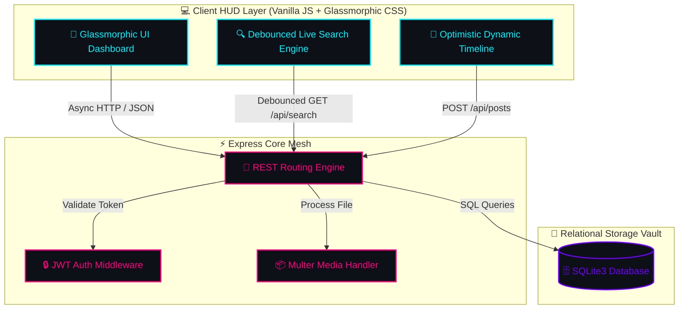

<div align="center">

  <!-- FUTURISTIC TYPING HEADER -->
  <a href="https://git.io/typing-svg">
    
  </a>

  <p align="center">
    <b>A Hyper-Responsive, Cyberpunk-Inspired Full-Stack Social Experience</b>
  </p>

  <!-- ANIMATED BADGES ROW -->
  <p align="center">
    <a href="#-core-architecture">
      
    </a>
    <a href="#-core-architecture">
      
    </a>
    <a href="#-core-architecture">
      
    </a>
    <a href="#-core-architecture">
      
    </a>
    <a href="LICENSE">
      
    </a>
  </p>

  <!-- GLOWING ANIMATED WAVE DIVIDER -->
  

</div>

<br>

> [!NOTE]
> 🛸 **System Status**: `ONLINE` | **Signal**: `OPTIMAL (100% Cyber-Mesh Integrity)` | **Protocol**: `RESTful v1`
> **PulseNet** is an ultra-modern, high-octane social platform engineered with Node.js, Express, SQLite, and vanilla CSS3 micro-animations. It fuses high-speed data propagation with a sleek glassmorphic HUD layout.

---

## 🔮 Interactive Feature Matrix

```gcode
 [SYSTEM HUD] ───► REAL-TIME FEED INTEGRITY ──────────► [100% ONLINE]
 [MODULE 01]  ───► JWT ZERO-TRUST AUTHENTICATION ──────► [ACTIVE]
 [MODULE 02]  ───► LIVE DEBOUNCED SEARCH MATRIX ───────► [ACTIVE]
 [MODULE 03]  ───► MEDIA PIPELINE (MULTER INFRA) ─────► [ACTIVE]
 [MODULE 04]  ───► SOCIAL GRAPH (FOLLOW/LIKE/MENTION) ─► [ACTIVE]
```

<details open>
<summary><b>✨ 🛰️ Module Breakdown (Click to collapse/expand)</b></summary>

<br>

| Feature Module | Tech Stack / Engine | Visual & Micro-Interaction Status |
| :--- | :--- | :---: |
| 🛡️ **Zero-Trust Auth** | `JWT` + `BcryptJS` (Salt: 10) | `<span style="color:#00FF66">● ENCRYPTED</span>` |
| 📰 **Dynamic Feed** | Async Fetch + DOM Diffing | `<span style="color:#00F3FF">⚡ INSTANT PROPAGATION</span>` |
| ❤️ **Reaction Matrix** | Optimistic UI + Scale Pop | `<span style="color:#FF007F">💖 MICRO-ANIMATED</span>` |
| 👥 **Cyber Graph** | SQLite Cascading FKs | `<span style="color:#7000FF">🔗 REALTIME COUNTERS</span>` |
| 🔍 **Quantum Search** | Debounced Dynamic Filter | `<span style="color:#00F3FF">🎯 LIVE DROPDOWN</span>` |
| 📸 **Media Storage** | `Multer` Direct Stream | `<span style="color:#FFB700">🖼️ IMAGE & VIDEO READY</span>` |

</details>

---

## 🌌 Cyberpunk UI Preview Architecture



---

## ⚡ Quick Start Protocol

Execute the following terminal sequence to boot up the PulseNet ecosystem:

```bash
# 1. Clone the Cybernet Repository
$ git clone https://github.com/YOUR_USERNAME/pulsenet-social-platform.git

# 2. Navigate into the Core Terminal Directory
$ cd pulsenet-social-platform

# 3. Inject Dependency Modules
$ npm install

# 4. Synthesize Sample Seed Database
$ npm run seed

# 5. Ignite the Futuristic Core Server
$ npm run dev
```

> [!TIP]
> Navigating to `http://localhost:3000` will automatically launch the **PulseNet Glassmorphic Interface**.

---

## 📂 System Directory Topology

```
⚡ PULSENET_CORE
 ├── 📁 data/                  ► [DB Vault] SQLite database instance
 ├── 📁 public/                ► [Client Engine]
 │    ├── 📁 css/              ► Glassmorphism & micro-interaction styles
 │    ├── 📁 js/               ► Single-Page App reactive logic controller
 │    ├── 📁 uploads/          ► Media storage buffer
 │    └── 📄 index.html        ► Futuristic HUD Layout
 ├── 📁 src/                   ► [Core Logic Node]
 │    ├── 📁 db/               ► Schema definition & DB seed routines
 │    ├── 📁 middleware/       ► JWT Security barrier
 │    └── 📁 routes/           ► Auth, Posts, User Graph & Search routes
 ├── 📄 server.js              ► Application Master Server
 ├── 📄 .gitignore             ► Exclusion matrix
 ├── 📄 LICENSE                ► Open Source MIT License
 └── 📄 README.md              ► Cyberpunk Systems Manual
```

---

<div align="center">

  <!-- ANIMATED TYPING FOOTER -->
  <a href="https://git.io/typing-svg">
    
  </a>

  <br>

  

  <p><b>Crafted with ⚡ for CodeAlpha Task 2</b></p>
  
  [](https://github.com/)

</div>
